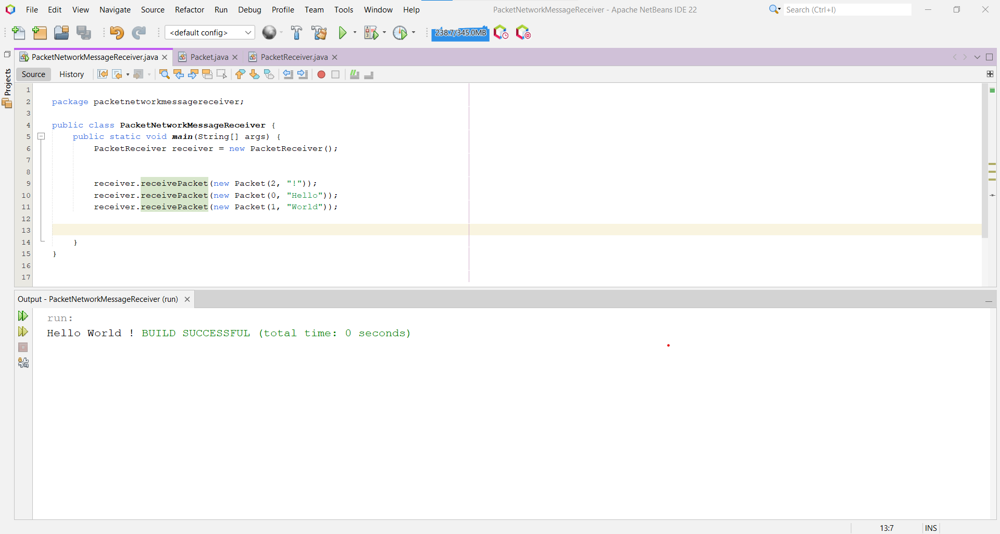
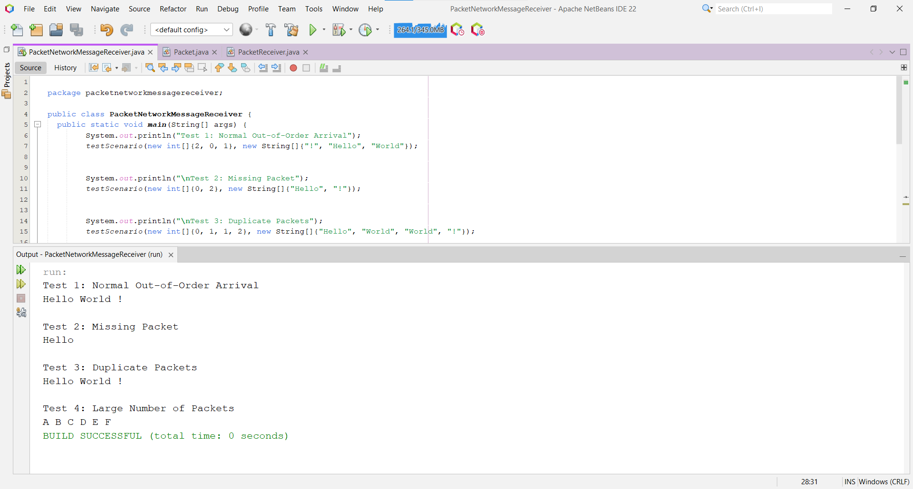

# PacketNetworkMessageReceiver

# 📡 Network Packet Message Receiver
This project simulates a **network packet receiver** that reconstructs messages from **out-of-order packets**.

## 📌 Project Overview
In a network, messages are broken into **packets** that may arrive **out of order** due to transmission delays.  
This program:
✔ Accepts packets **in any order**  
✔ **Sorts & reorders** them correctly  
✔ **Reconstructs** the full message  
✔ Handles **missing/delayed** packets gracefully  

---

## 🎯 Why Use a Linked List?
- **Efficient Insertion**: Packets can be inserted at any position without shifting elements.
- **Maintains Order**: Keeps packets sorted dynamically.
- **Built-in Methods**: Java’s `LinkedList` provides useful operations like `add(index, element)`.

---

## ⚙️ How It Works
### 🔹 1. Packet Class
Each packet contains:
- `sequenceNumber` → Determines the correct order.
- `data` → Holds the message fragment.

### 🔹 2. PacketReceiver Class
- Stores packets in a `LinkedList` sorted by `sequenceNumber`.
- Processes packets sequentially to **reconstruct the message**.
- Handles **missing packets** by waiting or requesting retransmission.

---

## 🚀 Example Execution
### **Scenario**
The message is split into three packets:
| Sequence | Data  |
|----------|-------|
| 2        | "!"   |
| 0        | "Hello" |
| 1        | "World" |

---

### **Out-of-Order Arrival**
Packets arrive in this order:

### **Processing Order**
1️⃣ Insert `2` → Buffer: `[2]`  
2️⃣ Insert `0` → Buffer: `[0, 2]`  
3️⃣ Insert `1` → Buffer: `[0, 1, 2]`  

🔹 **Processing starts:**  
✅ `0` matches `expectedSeq=0` → Output **"Hello"**  
✅ `1` matches `expectedSeq=1` → Output **"World"**  
✅ `2` matches `expectedSeq=2` → Output **"!"**  

### ✅ Final Output:

---

## 📸 Screenshots
### 🔹 Example Packet Processing  

### 🔹 Final Reconstructed Message  

---

